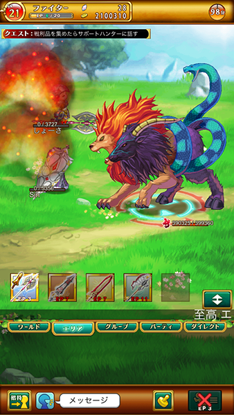
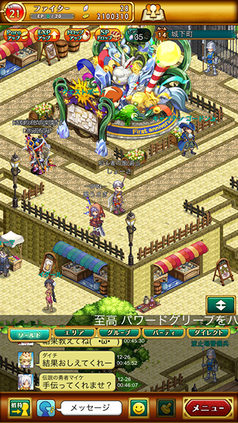
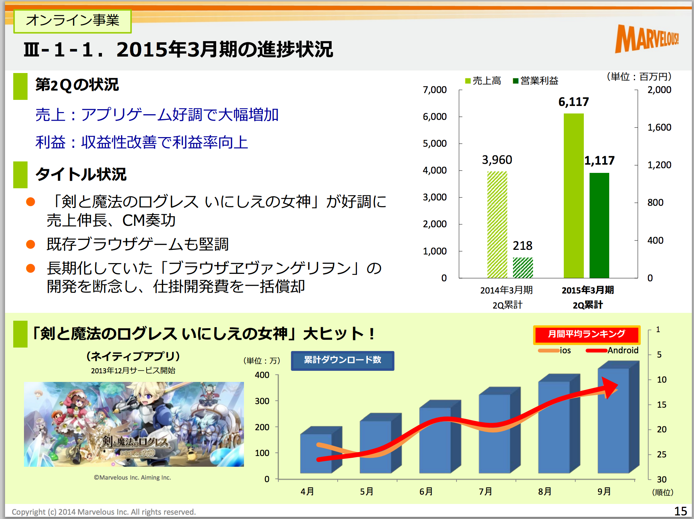
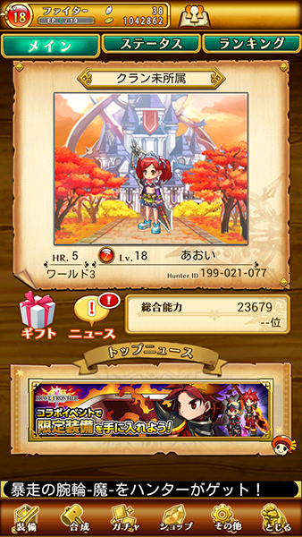
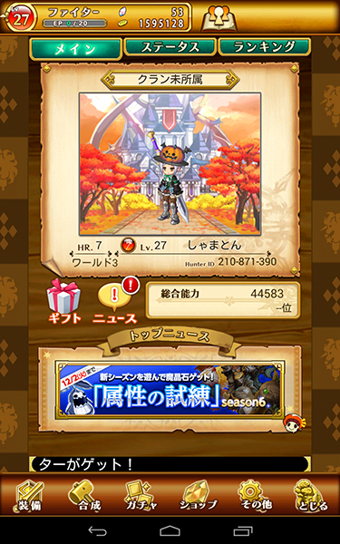
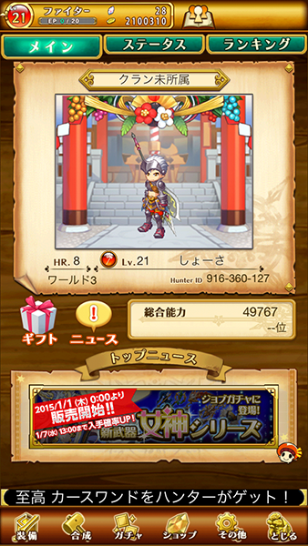
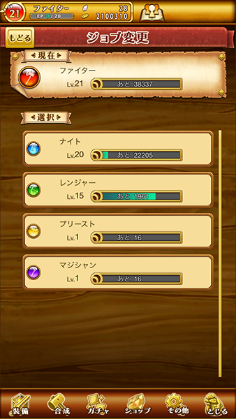

# アプリ体験レポ

## 藤井 / 社本 / 武富

---

### アジェンダ

* 選んだゲーム
* どんなゲーム？
* 何でこのゲーム？
* どのくらい遊んだ？
* 感想

---

## 選んだゲーム

---

## どんなゲームよ？

--

|            |                              |
|-----------:|:-----------------------------|
| タイトル ： | 剣と魔法のログレス いにしえの女神 |
| ジャンル ： | 本格RPG                       |
| 配信時期 ： | 配信中                        |
| 対応機種 ： | Android4.0以降 iOS5.0以降     |
| 運　　営 ： | マーベラスAQL                  |
| 開　　発 ： | Aiming                       |

--

### ゲーム画面とか

--

### 特徴

* ブラウザ版ログレス（Flash）コンテンツが前身
* スマホゲーにしては比較的珍しいMMORPG
* リアルタイムに他のユーザーと協力プレイが出来る
* コミュニケーション機能は充実してる
* モンハンみたくクエスト選んで進める方式

---

## 売上は？

---

---

* 見ての通り順調
* DL数は現在累計で400万DL突破してる模様
* 人気IPとのコラボがヒットに繋がったらしい(※)

(※)http://gamebiz.jp/?p=128450

---

### で、実際面白かったかというと…

---

### 全員､思ったよりも
### 早く飽きが来てしまいました

藤井とか1万課金して飽きる始末…

---

### 何故飽きたのか？

* 起動が重い｡特に通信環境によってはタイトル画面で固まる｡
* クエストを進めるのに似たような場所に何度も行くことが多かった。
* マップの移動が少しだるい

---

## 感想とそれぞれのステータス

---

### 武富さん

---

### 社本さん

--

* 目標が単調なので､ある意味なにも考えずやることができて､よいと思った｡
* 盛り上がっているフィールドでの､わらわら感のある割り込みバトルは面白いと思った
* やってみるとやはりMMOだったので､やり続ける絶望を感じてしまった

---

### 藤井

--

* スマホゲーのMMOの中では比較的スマホ最適化できてる
* 戦闘自体は装備に依存しつつも､ある程度の戦略性はそこそこある
* 上級職のありがたみがハードル高い割にあまり感じられない
* 少し放置しただけでリロードするのがストレスフル

---

## 総評

---

*

---
