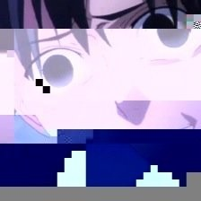
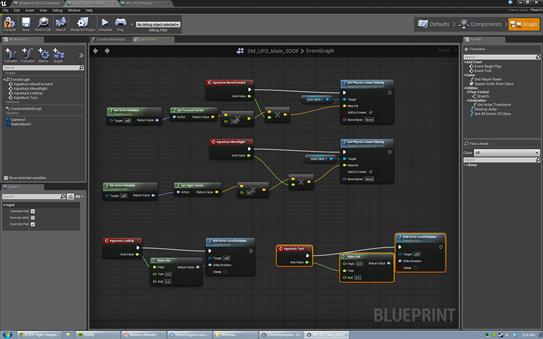

# UE4勉強会行ってきた感想とか

---

## 自己紹介

* HN：しょーさ
    * 今年の夏ぐらいにF社から:D社に移籍しました。
* [twitterID：syo_sa1982](http://twitter.com/syo_sa1982)

---

## 告知

KansaiDeveloperGathering 第２回

* 2014-12-08（月）19:00 - 22:00
* バンタンゲームアカデミー大阪校
* 無料(懇親会は1500円)
* [詳しくはDoorkeeperで](http://kdevg.doorkeeper.jp/events/16750)

---

## 本題

11月1日に第2回 Unreal Engine4 勉強会に行ってきたので

適当に感想でもしゃべります。

---

## [50分でわかるブループリントについて](http://www.slideshare.net/masahikonakamura50/50-40986508)

[@aizen76さん](http://twitter.com/aizen76)

--

## ブループリントとは

* UE４で初めて搭載されたヴィジュアルスクリプティングシステム
* ノードベースによるスクリプティング
* ほとんどのゲームロジックを作成可能
* 語弊を恐れずにいうとテキストベースのプログラミングより強力
* 強力なリアルタイムプロパティ編集、ヴィジュアルデバッガの存在がでかい
* コードだけじゃ出来ないこともデキル

--
 
### 要はこんなの
 

--

## 感想

* プログラマじゃなくてもゲームが作れそう！
* でもゲームロジック考える能力は必須
* 高校レベルの数学の知識も

---

## [猫でも分かるUE4](http://www.slideshare.net/pafuhana/unreal-engine4ue4-2014111)

[おかず(pafuhana1213)さん](http://twitter.com/pafuhana1213)

--

## どんな内容？

* キャラクターの動かし方・当たり判定
* ゲームのルール作り
* マテリアルエフェクト

…等々、丁寧に説明していました。

--

## 感想

* UE4でゲームを作るまで流れが、わかりやすかったです。
* UE4の優秀さがよく分かる発表でした。

---

### [パーティクルエフェクトのマテリアル](http://www.slideshare.net/toaru_designer/ue4-40997046)
### [パーティクルへのライティング](http://www.slideshare.net/toaru_designer/ue4-41024572)

某グラフックデザイナーさん

--

## 感想

* この辺りはハイレベルすぎて自分にはついていけませんでした。
* 手元にUE4の環境があれば、もっと身についたんだろうなと。

---

## 感想まとめ

* UE4だとそれなりのゲームはUnity以上に簡単に作れそう
    * スマホゲーはどうなのか、わからないけど
* 近いうちにUE4動かす環境用意して、本格的に勉強してみたくなった。
* プログラマもデザイナーもUE4やろうず！

--
