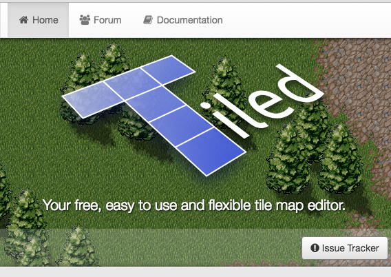

# Unite Tokyo 2016 報告

## 藤井

---

## 誰やねん？
## ▼

--

* 名前
  * 藤井 陽介
* お仕事
  * ブラウザゲームのフロントエンド担当
* 好きな物
  * ゲーム、プログラミング、クラブミュージック
* その他
  * Go言語の勉強会やってます！
    * http://kug2.connpass.com/

---

## 何見たん？
## ▼

--

* モバイル端末向けの
  Unityアプリケーションの最適化実践テクニック<!-- .element: class="fragment fade-out" data-fragment-index="1" -->
* ビルディング・2Dワールド in Unity ～2D機能のあれやこれや～<!-- .element: class="fragment highlight-green" data-fragment-index="2" -->
* Unityグラフィックス最新機能ガイド<!-- .element: class="fragment fade-out" data-fragment-index="1" -->
* Unity CollaborateとUnity Cloud Buildを
  使って開発サイクルを高速化！<!-- .element: class="fragment fade-out" data-fragment-index="1" -->
* ハードウェア性能を引き出して
  60fpsを実現するプログラミング・テクニック<!-- .element: class="fragment highlight-green" data-fragment-index="2" -->
* 学校では教えてくれないアセットバンドルのしくみ<!-- .element: class="fragment fade-out" data-fragment-index="1" -->
* Unity上級者を目指すなら知っておくべきデバッグテクニック集<!-- .element: class="fragment fade-out" data-fragment-index="1" -->
* インテルのハードウェア・メトリックを
  使用して Unity 対応アプリケーションを高速化<!-- .element: class="fragment fade-out" data-fragment-index="1" -->
* Unity In-App Purchasingを使った実践マネタイズ講座<!-- .element: class="fragment fade-out" data-fragment-index="1" -->
* Unity Google Extreme 2016<!-- .element: class="fragment fade-out" data-fragment-index="1" -->

---

## で、どうやったん？

---

## ハードウェア性能を引き出して60fpsを実現するプログラミング・テクニック
## ▼

--

# 最高だった

--

* 詳しくは資料公開されている
* 簡単に言うと…
    * ゲームロジックは別スレッドでC#フルスクラッチ
      * UnityAPI使わない
      * collisionも物理もフルスクラッチ
    * ParticleもなるべくShaderで書く
    * ゲームプレイ中のGCの発生はなるべく抑える
* …って、やればパフォーマンス出るよ。

--

### それ、Unity使う意味有るの？

--

### 有ります

* ポーズメニュー（要はUI）はすぐ作れる
* 統合環境
* マルチプラットフォーム

--

### これだけでも充分Unityのメリット有るよね？

---

## ビルディング・2Dワールド in Unity ～2D機能のあれやこれや～
## ▼

--

# 最高だった

--

* スライドは公開されてない（デモのみ）
* Unity5.4のβ版に実装されている新2D機能
* 主な機能
  * 9スライス
  * アトラス
  * スマートスプライト
  * タイルマッパー

--

## 要はどういう機能？
<!-- .element: class="fragment fade-in" data-fragment-index="1" -->

--

--

## 開発者からのメッセージ

* 是非β版をインストールして使ってみてください。
* そして、良かった点や悪かった点をフィードバックして共有してください。

--

# 使おう!!

---

## 総括

--

*

