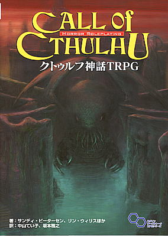
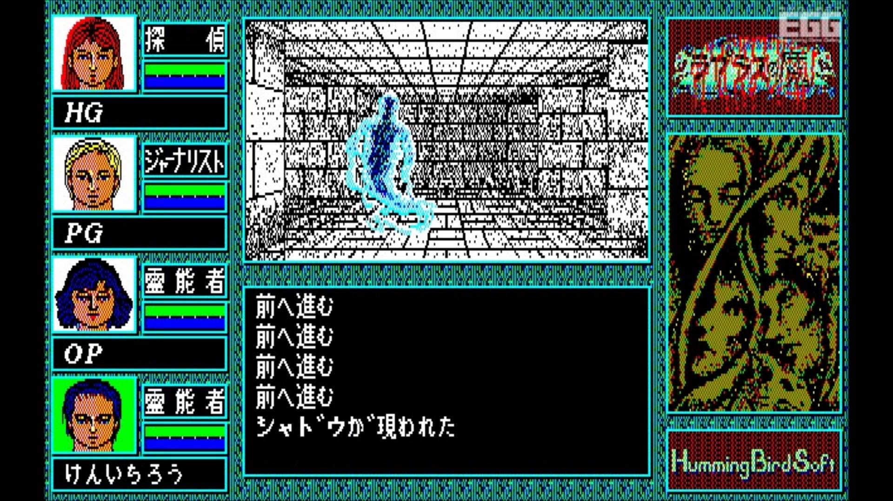
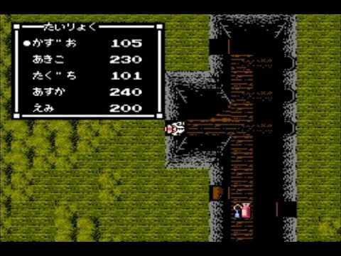

# 活動報告

## 藤井

---

## 何作ってるねん？

--

  ### モチーフはこれ
  

--

* クトゥルフTRPGを元にしたホラー要素ありのソシャゲ
  * よくあるHTTPベースのAPI+Unityゲー
* ガチャは引かない
* 自分でキャラを作る
* 他ユーザーのキャラとマッチングでソーシャル要素出す
* 追加でキャラ作りたかったら金払えって言うスタンス
* でも、1人だと課金周り管理するのは荷が重い
    * 広告収入しか無い

--

### ゲーム画面はこんな雰囲気

--

  

--

  

--

# デモ

---

## 今どうなん？

--

* とりあえず、キャラ作成は一通り作った
* 実機で動かせるようにサーバーセットアップ中
  * もうすぐ終わるけど

--

* メインのゲームサイクルはまだこれから
  * 探索
    * マップデータはサーバー側からDLさせたい
  * 戦闘
  * イベントシーン
  * 他ユーザーとのマッチング
* 後はとりあえず、作りながら考えるかって言うスタンス

---

## どうやって作ってるん？

--

* クライアントサイドは言わずもがなUnity
* サーバーサイドはnginx + Go + MySQL
* 後はビルド周りとか自動化したい。
  * Jenkins使う予定だけど、Circle CIも気になる

---

## どっか苦労とか失敗した？

--

* クトゥルフTRPGのルールで言う、技能振り分けの制御が面倒だった
* 最初よくわからないままGo書いててhttpもAPIも両方制御しようとしてた
  * httpの制御はnginxで
  * Goの役目はAPIを返すだけ
* UnityでAPI扱うときに何もわからんままMiniJson使ってた
  * 結果、型のキャストがめんどくさくなった
  * なので、LitJsonに乗り換えた。
    * 結果、楽になった
* 久々にインフラ周りの整備したので、環境設定が少し不安

---

## 課題点は？

--

* 当然今は見た目がしょぼい
  * 今後少しずつリッチにしていく
* 探索はタイルマップ使いたいけど、
  サーバー側でマップのデータ持ってやり取りする方法がまだわかってない。
  * 多分AssetBundle使うイメージ？
* 初期の実装がカオスってるので、そろそろリファクタリングをしたい
* 1人でやってる時の弊害
  * 嵌った時、解決に時間かかる
  * 実装内容の是非の判断がしにくい
  * プログラムは書けても絵は描けないのでフリー素材に頼るしか無い

---

## 今後どうするん？

--

* 当然ながら、AppStoreなどに公開するつもり
* 最終的にはBitSummitの出展目指…したい
  * 2016か2017か
* 表現とかはもう少しリッチにしていきたい
* そろそろテスト書かなきゃ（使命感
* めっちゃ先の話になるけど、リアルタイムでの協力プレイも盛り込みたい
  * けど、今までhttpで書いてたサーバーをTCP/IPに変えないといけない

